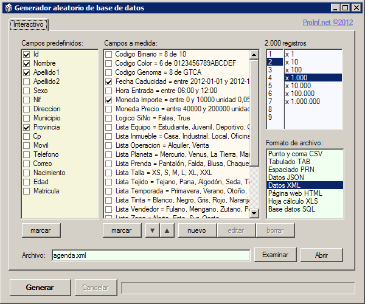
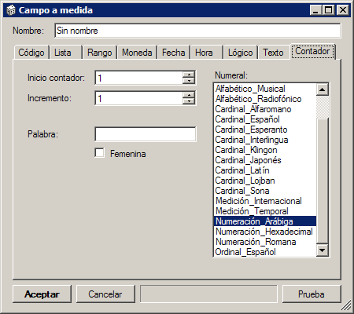

# bdAzar

Rellena una tabla con datos aleatorios. 
Los formatos de exportación posible son: CSV, tabuladores, espaciado, JSON, XML, HTML, XLS y SQL. 
Se pueden seleccionar los campos de unos ya predefinidos o se puede agregar nuevos campos personalizados. 

## Más documentación en la página web

[Generador aleatorio de base de datos](https://www.proinf.net/permalink/generador_aleatorio_de_base_de_datos)

## Pantallazos

